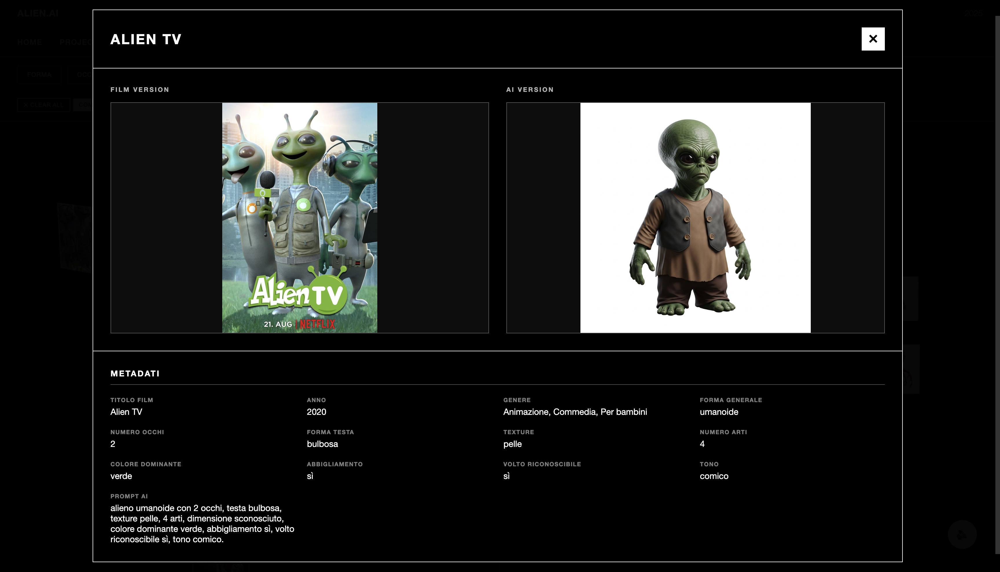

### DDD-2025-GroupX
<h5> Drini Bejtaga - Walter De Nicola - Roberta Valli</h5>

# Alien.Ai

### Video Demo

<video width="600" controls>
  <source src="docs/08_video.mp4" type="video/mp4">
</video>

### Abstract (300 charachters)
This project investigates how people claim to communicate with alien species by gathering posts, reports, and shared experiences from online communities and public archives. The material was organized, coded, and grouped to uncover repeating themes and moments of collective attention. To make the findings clearer, the grouped data was transformed into timelines and location-based views that show when and where the conversations intensified. The highlights point to shared narratives appearing across different communities, synchronized waves of reported signals, and recurring ideas about how contact might take place.

### Protocol Diagram

### What topic does the project address?
ALIEN.AI explores how cinematic creatures and AI-generated beings converge, diverge, and evolve within visual culture. Through an interface that combines thematic filters, immersive navigation, and morphological decomposition, the project highlights recurring structures and unexpected variations in forms and features. By placing film imagery and synthetic outputs in direct dialogue, ALIEN.AI reveals how different modes of creation shape and reinterpret extraterrestrial representations.

## What Data Have You Considered?

This project is based on an original dataset developed to compare alien representations from films with their AI-generated counterparts.

### Images From Films
The dataset contains 100 alien images manually sourced from a variety of films.  
Images were selected by identifying clear frames or promotional stills where the creature is fully visible. Earlier attempts to automate the collection (such as using the SERP API) were tested but discarded, resulting in a fully hand-curated dataset.

### AI-Generated Alien Images
For each film alien, a corresponding AI-generated version was produced using different generative models, including Google Imagen 4.0, OpenAI tools, and Google Gemini.  
Prompts were created after a manual visual analysis of each film image, describing:
- body shape  
- head structure  
- number of eyes  
- surface texture  
- colors  
- morphological features  

### Structure of the Final Dataset (CSV)
The final dataset consists of 100 rows, one for each film alien.  
Each row contains:
- the original film image  
- a structured visual analysis  
- the AI prompt derived from that analysis  
- the link to the corresponding AI-generated image

  
A data-cleaning phase unified categories (e.g., colors, genres), corrected inconsistencies, and standardized all terminology.

**Fields included in the CSV:**
- film_title  
- film_year  
- cinematic_genre 
- general_shape  
- number_of_eyes  
- head_shape  
- surface_texture  
- number_of_limbs  
- size_relative_to_human  
- dominant_color  
- clothing  
- recognizable_face  
- dominant_tone  
- secondary_details  
- ai_prompt  
- file_name 

 

### Morphological Parts Dataset
Both film and AI images were processed into anatomical fragments:
- head  
- chest  
- arms  
- hands  
- feet  

Croppings were obtained through a semi-automatic script and then refined manually.  
This secondary dataset enables the morphological decomposition used in the interface.

### Visualisation

#### Link to the dataset
[Dataset](https://docs.google.com/spreadsheets/d/14JPReuqHkJ0FZBQmdKYLOpbdxL6lTCA5O_opcV6fpcE/edit?gid=499035760#gid=499035760)

### What does the visualisation show?

- Prevalence of Humanoid Forms in AI Images:  
AI generations show a strong tendency toward anthropomorphic shapes: proportional bodies, human-like hands, and recognizable facial traits.
Even when the prompt does not request a human figure, the model often reshapes the alien into an “almost human” morphology, contrasting with the greater diversity seen in cinematic creatures.

- Addition of Elements Not Present in the Prompt:  
Generative models frequently enrich the output with details that were not requested: extra limbs, more complex textures, background elements, and especially full-body representations.
Even when the prompt describes only facial features, the AI tends to complete the entire body, revealing a bias toward generating “complete” characters.

- Poor Alignment With the Requested Tone:  
Even when prompts specify a clear emotional tone — humorous, light, neutral, or otherwise — the AI struggles to follow it.
Outputs often converge toward serious or dark expressions, showing limited sensitivity in translating emotional or atmospheric nuances that fall outside conventional representations of alien creatures.

